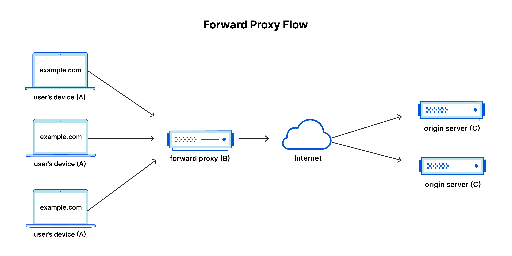

Original post: https://www.cloudflare.com/learning/cdn/glossary/reverse-proxy/

Wherever the proxy sits, it protects that resource.

# I. Forward Proxy

Forward Proxy sits in front of client, it will forward client request to the server. Seems mainly used in client identity security (hide identity, prove identity to access certain server resource)

# II. Reverse Proxy

Reverse Proxy sits in front of server. In other words, a reverse proxy receives requests from clients and forwards them to the appropriate web server or servers, acting as an intermediary between the client and the server. 

Reverse Proxy allows control over server resource. Due to that, it can provide:
* Load balancing
* Hide and protect server resource from the internet